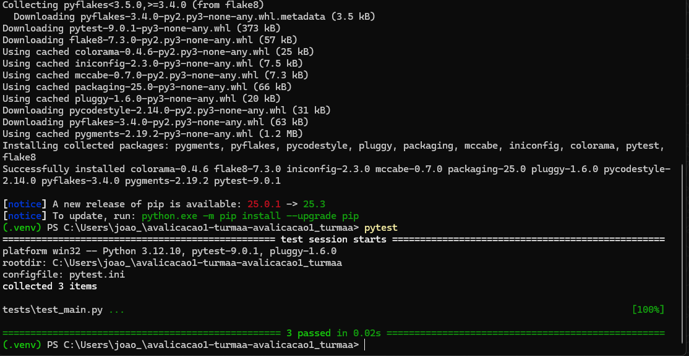

# Avaliação 1 – Etapa 1: Preparação Técnica e Integração com Azure

Documentação e evidências da avaliação 1, referente à criação de pipeline CI para Python e provisionamento de infraestrutura no Azure com Terraform.

1. Identificação
Aluno: Joao Victor

Grupo: Grupo 1

Repositório: [Link para este repositório]

2. Evidências de Execução
Etapa 1: Python - CI (Integração Contínua)

    A. Testes Unitários (Pytest)

estes executados localmente para validar a lógica da aplicação app/main.py.

    B. Verificação de Estilo (Flake8)

Verificação de linting executada localmente, garantindo que o código segue as convenções do PEP 8 (nenhum erro retornado).

3. Pipeline de CI (GitHub Actions)

Etapa 2: Terraform - IaC (Infraestrutura como Código)

Em desenvolvimento. 

